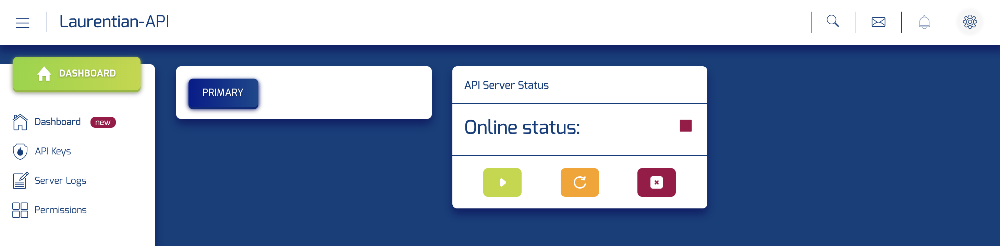
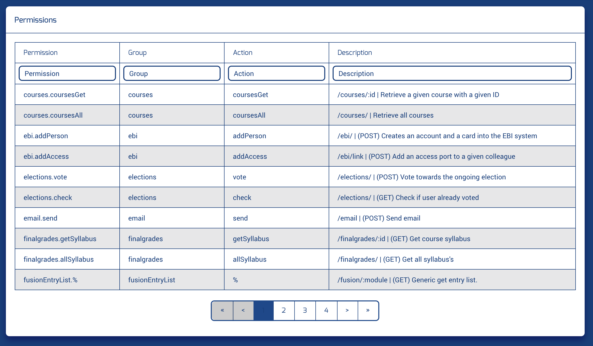

# API Console

## TODO:

 * System monitoring (Shutdown, restart, status, start)
 * API key management (URL)
 * Log management
 * Permission List
 * Action list & details
 * Fusion CRM access tables
 * Notification System 
 * 
 
 

